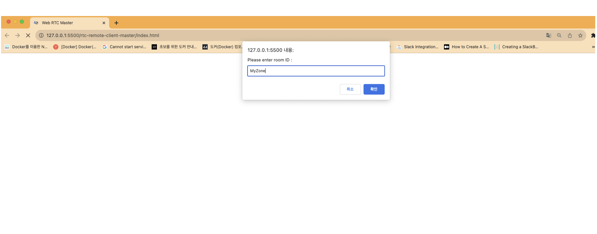
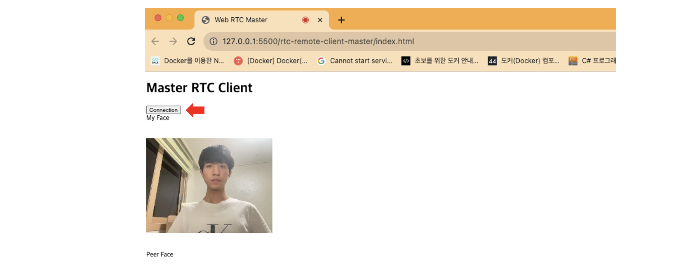
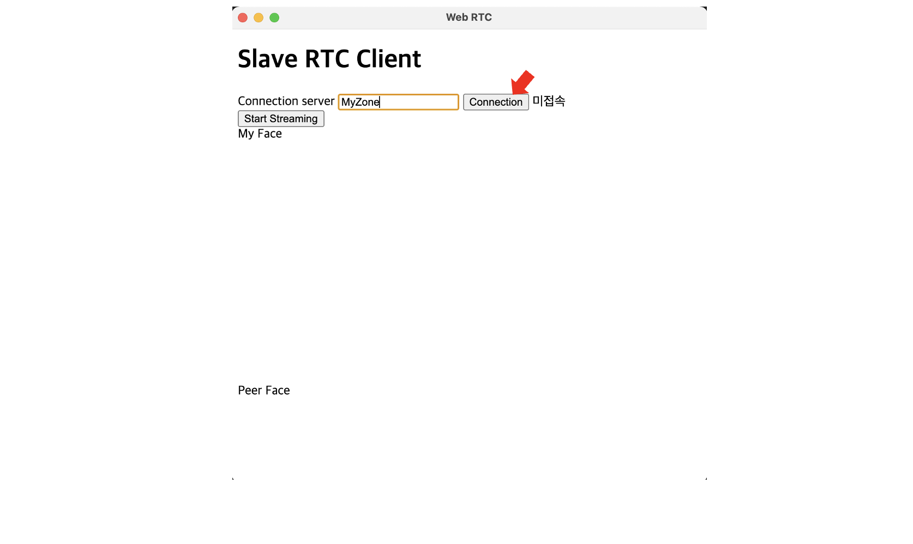
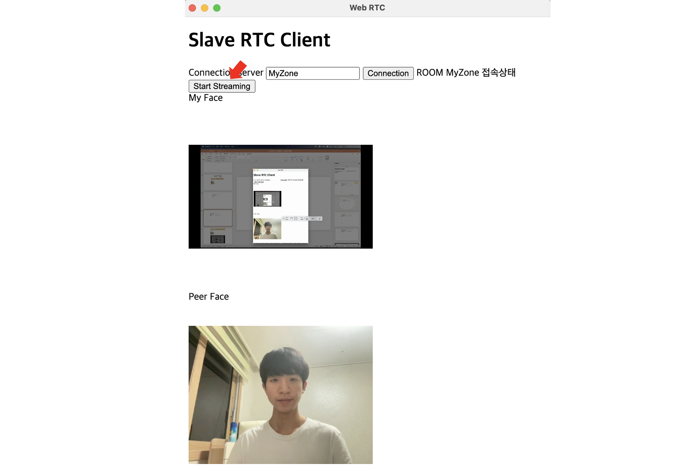
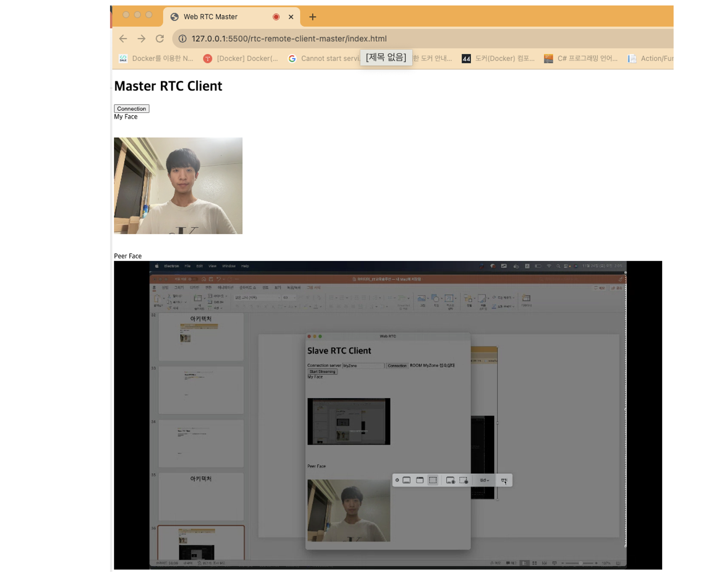

# TOYPROJECT_SimpleWebRTC
## 간단한 P2P 미디어 스트리밍 공유
 

  
## 1. Feature
 
Web RTC 기술을 통하여 간단한 P2P 스트리밍 기술을 구현한 토이 프로젝트

두 개의 형태의 클라이언트(웹, 응용 프로그램)이 P2P 통신을 하게 되도록 구성해보았다.   
본 프로젝트에서는 웹 클라이언트는 Master Client라고 칭하고 응용 프로그램 클라이언트는 Slave Client라고 칭한다.
   
P2P 통신을 하게 될 고유한 이름의 Room에 한 개의 Master와, 한 개의 Slave가 접속하게 되면 통신이 시작되게 된다.
   
Master은 자신의 캠코더와 음성 스트리밍을 공유하게 되며, Slave는 자신의 윈도우 스크린 스트림을 공유하게 된다.
  
  

Toy Project Implementing Simple P2P Streaming Technology Through Web RTC Technology

Two types of clients (web, application programs) are configured to perform P2P communication.   
In this project, web clients are referred to as Master Client and application clients are referred to as Slave Client.

When one Master and one Slave connect to the Room with a unique name that will perform P2P communication, communication begins.

The Master  will share voice streaming with his camcorder, while Slave will share his Windows screen stream.

------------------

## 2. Stacks

- Node Version : 15.14.0 (When I was working on it)
- Server (Signaling Server) : Node.js / Socket.io
- Master Client (Web) : Vanila JS
- Slave Client (Application) : Vanila JS + Electron.js

------------------

## 3. Proejct Structure and Setting

### 3-1. rtc-remote-server (Server, Signaling Server)
- **패키지 설치(Package Install)** : npm install
- **App 시작(Application Run)** : npm start

### 3-2. rtc-remote-client-master (Master Client)
- 단지 HTML을 실행시키면 된다. (You just need to run HTML.)

### 3-3. rtc-remote-client-slave (Slave Client)
- **패키지 설치(Package Install)** : npm install
- **App 시작(Application Run)** : npm start
- **App 빌드(Application Build)** : 만약 Electron App을 빌드하여 응용 프로그램 exe 형태로 만들고 싶을 때 사용    
(If you want to build the Electron App and create it in the form of an application exe, use it)
    - For Mac M1 : npm run deploy:mac-arm
    - For Mac : npm run deploy:mac-x64
    - For Windows 32bits : npm run deploy:win32
    - For Windows 64bits : npm run deploy:win64

------------------

## 4. How to Use

### 4-1.(Master Client) P2P 통신을 할 임의의 이름의 Room에 접속한다.
#### Access the room of any name for P2P communication.

 

### 4-2. (Master Client) Connection 버튼을 눌러 스트리밍을 시작하고 상대가 접속하기를 기다린다 
#### Press the Connection button to start streaming and wait for the other party to access

 

### 4-3. (Slave Client) 연결할 Master Client와 동일한 이름의 Room에 접속한다.
#### Access the Room with the same name as the Master Client you want to connect to.

 

### 4-4. (Slave Client) Start Shareing 버튼을 눌러 스트리밍을 시작하고 P2P 연결을 확인한다.
#### Press the Start Sharing button to start streaming and check the P2P connection.

 

### 4-5. (Master Client) Master 쪽에서도 Slave와 P2P 연결이 된 것을 확인할 수 있다.
#### It can be seen that the master side is also connected to Slave and P2P.

 

### 4-6. 물론 Master Client와 Slave Client의 접속 순서가 바뀌어도 괜찮다.
#### Of course, it is okay to change the order of connection between Master Client and Slave Client.